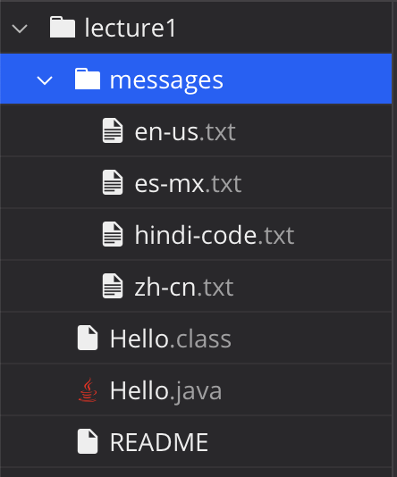

# CSE 15L LAB REPORT 1: Remote Access and FileSystem

## Examples Using the cd Command:

Files and Folders used:



cd command with no argument:

```
[user@sahara ~/lecture1]$ pwd
/home/lecture1
[user@sahara ~/lecture1]$ cd
[user@sahara ~]$
[user@sahara ~/lecture1]$ pwd
/home
```
The working directory when run was lecture1. The output returns an empty line. However, the current directory in the command prompt is reset to the root directory of home. This is not an error. 


cd command with a path to a directory as an argument:

```
[user@sahara ~]$ pwd
/home
[user@sahara ~]$ cd /home/lecture1
[user@sahara ~/lecture1]$ 
[user@sahara ~/lecture1]$ pwd
/home/lecture1
```
The working directory when run was home. When using the cd command on a path to a directory, it will change the current working directory to the listed directory in the argument. This is not an error.

cd command with a path to file as the argument:

```
[user@sahara ~]$ pwd
/home
[user@sahara ~]$ cd /home/lecture1/Hello.java
bash: cd: /home/lecture1/Hello.java: Not a directory
```

The working directory when run was home. When using the cd command with a path to a file, it outputs, “bash: cd: /home/lecture1/Hello.java: Not a directory”. This is an error because the cd command only works with a path to a folder or directory. Therefore, this output is an error.

## Examples Using the ls Command:

ls command with no argument:

```
[user@sahara ~]$ pwd
/home
[user@sahara ~]$ ls
lecture1
```

The working directory when run was home. This output was given because lecture1 is the folder within the home directory. Therefore, lecture1 is given as the output. The ls command will print out the folders and file in the working directory. This output is not an error. 

ls command with a path to directory as argument: 

```
[user@sahara ~]$ pwd
/home
[user@sahara ~]$ ls lecture1
Hello.class  Hello.java  messages  README
```

The working directory when run was home. This output was given because the files and folders under the lecture1 directory includes Hello.class, Hello.java, messages, and README. Therefore, those 4 are correctly given as the output. There is no error in this output.

ls command with a path to a file as the argument:

```
[user@sahara ~]$ pwd
/home
[user@sahara ~]$ ls /home/lecture1/Hello.java
/home/lecture1/Hello.java
```

The working directory when run was home. When the argument is the path to the file, the output is the given path to the file. This is not an error.

## Examples Using the cat Command: 

cat command with no argument

```
[user@sahara ~]$ pwd
/home
[user@sahara ~]$ cat
hello
hello
```

The working directory when run was home. The output given when cat is ran with no argument is a blank output that lets the user input something into the terminal. Then, the input the user gives is outputted again by the terminal as shown in the code block above. This happens because the cat command is used to concatenate and display the contents of various files. However, with no argument the cat command resorts to to input from the keyboard from the user themselves. This is not an error within the output. 

cat command with a path to a directory as the argument:

```
[user@sahara ~]$ pwd
/home
[user@sahara ~]$ cat /home/lecture1
cat: /home/lecture1: Is a directory
```

The working directory when run was home. When using the cat command with a path to a directory as an argument, it printed out “cat: /home/lecture1: Is a directory”. The terimnal will output that the path given will lead to a directory. This is not an error. 

cat command with a path to a file as the argument:

```
[user@sahara ~]$ pwd
/home
[user@sahara ~]$ cat /home/lecture1/Hello.java
import java.io.IOException;
import java.nio.charset.StandardCharsets;
import java.nio.file.Files;
import java.nio.file.Path;

public class Hello {
  public static void main(String[] args) throws IOException {
    String content = Files.readString(Path.of(args[0]), StandardCharsets.UTF_8);    
    System.out.println(content);
  }
}
```

The working directory when run was home. When using the cat command with a path to file as argument the terminal will output the contents of the file. This is not an error.


